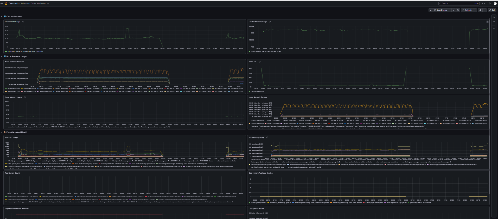
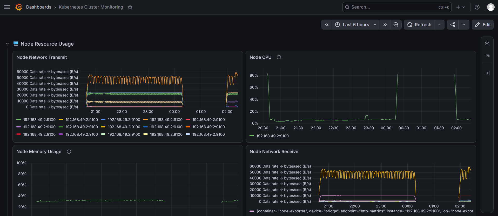
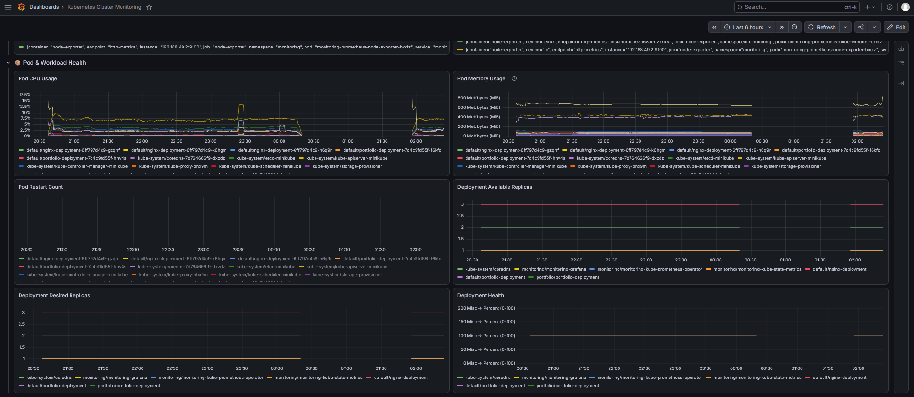
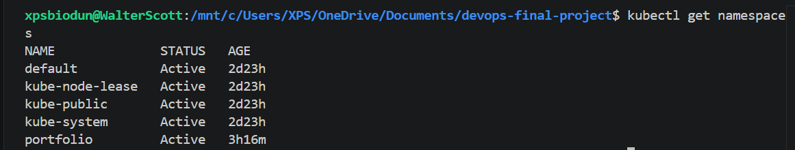
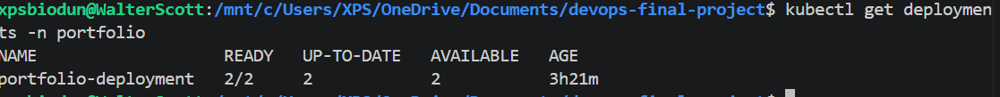
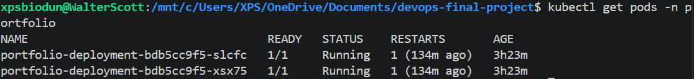
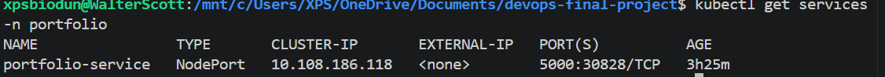
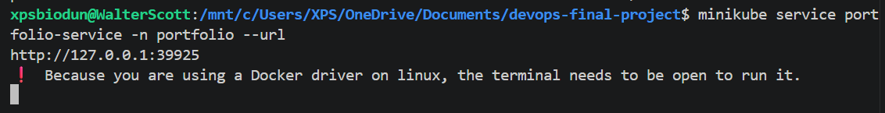

## ☸️ Project 3 — Kubernetes Monitoring & Observability

This phase of the project focuses on deploying containerized workloads to Kubernetes and implementing an observability stack using Prometheus and Grafana.

### Monitoring Stack

- ☸️ Kubernetes
- 🔥 Prometheus
- 📈 Grafana
- 📊 kube-state-metrics
- 🖥️ Node Exporter
- 🔎 PromQL

### Observability Coverage

- Cluster CPU usage
- Cluster memory usage
- Node CPU usage
- Node memory usage
- Pod CPU usage
- Pod memory usage
- Pod restart count
- Node network receive/transmit
- Deployment desired replicas
- Deployment available replicas
- Deployment health

### Operational Outcome

The monitoring platform provides centralized visibility into Kubernetes infrastructure, workloads, and deployment health through Grafana dashboards backed by Prometheus metrics.

# 🏗 System Architecture

The deployment process follows this workflow:

```text
Developer
     │
     │ git push
     ▼
GitHub Repository
     │
     ▼
GitHub Actions
     │
     ▼
Terraform
     │
     ▼
AWS EC2 Instance
     │
     ▼
Ansible
     │
     ▼
Docker Compose
     │
 ┌───┴──────────┐
 ▼              ▼
Portfolio      Java App
Flask          Tomcat
Port 5000      Port 8080
```

---

# ☸️ Kubernetes Observability Architecture

The Kubernetes monitoring environment uses Prometheus to collect metrics from the cluster and Grafana to visualize operational health.

```text
Kubernetes Cluster
        │
        ├── Nodes
        │     └── Node Exporter
        │
        ├── Pods
        │     ├── Portfolio Application
        │     └── Java Application
        │
        ├── Deployments
        │
        └── kube-state-metrics
                  │
                  ▼
             Prometheus
                  │
               PromQL
                  │
                  ▼
               Grafana
                  │
                  ▼
        Kubernetes Monitoring Dashboard
```

---

# ☁️ Infrastructure Provisioning

Infrastructure is provisioned using **Terraform**, enabling Infrastructure as Code (IaC) for repeatable deployments.

Terraform provisions:

- Amazon EC2 Instance
- Virtual Private Cloud (VPC)
- Security Group
- SSH Access

## Security Group Rules

| Port | Purpose |
|------|---------|
| 22   | SSH |
| 5000 | Portfolio Application |
| 8080 | Java Application |

Terraform ensures that the infrastructure can be recreated consistently without manual configuration.

---

# ⚙️ Configuration Management

Server configuration is automated using **Ansible**.

The Ansible playbook performs the following tasks:

- Updates Ubuntu packages
- Installs Git
- Installs Docker
- Starts Docker service
- Clones the GitHub repository

This ensures every server is configured consistently.

---

## 📋 Prerequisites

Before running this project, ensure you have:

- AWS Account
- Terraform
- Docker
- Docker Compose
- Ansible
- Git
- GitHub Account

---

# 🐳 Containerization

Both applications are containerized using Docker.

## Portfolio Application

- Python Flask
- Port 5000

## Java Application

- Apache Tomcat
- Port 8080

Each application contains its own Dockerfile.

Docker Compose is used to deploy both applications together.

Deployment command:

```bash
docker compose up -d --build
```

This command:

- Builds Docker images
- Creates containers
- Restarts services
- Publishes application ports

---

# 🚀 CI/CD Pipeline

Continuous Deployment is implemented using **GitHub Actions**.

Whenever code is pushed to the **main** branch, GitHub Actions automatically deploys the latest version.

Pipeline workflow:

1. Checkout Repository
2. Connect to EC2 through SSH
3. Pull latest code
4. Build Docker images
5. Restart containers using Docker Compose

Deployment command executed on EC2:

```bash
cd /home/ubuntu/devops-final-project

git pull origin main

docker compose up -d --build
```

This removes the need for manual deployments.

---

# ✅ Deployment Verification

Deployment was verified using the following methods.

## Verify Containers

```bash
docker ps
```

---

## View Logs

```bash
docker logs portfolio-app

docker logs java-app
```

---

## Portfolio Website

```
http://<EC2_PUBLIC_IP>:5000
```

---

## Java Application

```
http://<EC2_PUBLIC_IP>:8080/sampleapp/
```

---

## CI/CD Verification

The deployment pipeline is configured to:

- Trigger automatically when changes are pushed to `main`
- Connect to the EC2 instance through SSH
- Pull the latest repository changes
- Build Docker images
- Restart services using Docker Compose

> **Current status:** The CI/CD workflow is configured, but the latest deployment verification is pending because the EC2 environment is temporarily unavailable.

---

# 📸 Screenshots

---

## ☁️ AWS Infrastructure

### EC2 Instance


### Terraform Output


---

## 🐳 Docker Deployment

### Running Docker Containers


### Portfolio Application


### Java Application


---

## ⚙️ GitHub Actions CI/CD

### CI/CD Workflow


---

## 📊 Kubernetes Monitoring & Observability

### Full Grafana Dashboard Overview



### Node Resource Usage



### Pod & Workload Health



---

## ☸️ Kubernetes Deployment

### Namespace



### Deployment



### Running Pods



### Services



### NodePort Service URL



### Portfolio Running on Kubernetes


---

## 📂 GitHub Repository

### Repository Overview


---

# 🚀 Future Improvements

Future enhancements planned for this project include:

- Deploy the application to Amazon EKS
- Configure Kubernetes Ingress
- Secure the application with HTTPS using cert-manager
- Package deployments with Helm Charts
- Implement GitOps with Argo CD
- Enhance Prometheus & Grafana monitoring with custom alerts, dashboards, and SLO-based observability
- Configure Horizontal Pod Autoscaling (HPA)
- Enhance the CI/CD pipeline with automated testing and security scanning

---

# 📚 Skills Demonstrated

This project demonstrates practical experience with:

### ☁️ Cloud & Infrastructure
- Amazon Web Services (AWS EC2)
- Infrastructure as Code (Terraform)
- Cloud Infrastructure Provisioning

### ⚙️ Configuration Management
- Ansible
- Linux System Administration
- Server Automation

### 🐳 Containerization
- Docker
- Docker Compose
- Python Flask Containerization
- Java Application Deployment (Apache Tomcat)

### ☸️ Kubernetes
- Kubernetes
- Minikube
- kubectl
- Namespaces
- Deployments
- ReplicaSets
- Services
- NodePort Networking
- Application Scaling
- Self-Healing Workloads
- YAML Manifests

### 📊 Observability & Monitoring

- Prometheus
- Grafana
- PromQL
- kube-state-metrics
- Node Exporter
- Kubernetes Metrics
- Infrastructure Monitoring
- Workload Monitoring
- Dashboard Development

### 🚀 CI/CD & Version Control
- Git
- GitHub
- GitHub Actions
- Continuous Integration & Continuous Deployment (CI/CD)

### 📖 Documentation
- Technical Documentation
- Deployment Automation
- DevOps Best Practices

---

## 👨‍💻 Author

**Eyinafe Abiodun Emmanuel**

DevOps Engineer | Cloud Engineer | Platform Engineer

- 📧 Email: emmanuelabbeycity09@gmail.com
- 🌐 GitHub: https://github.com/walter-Scotts
- 💼 LinkedIn: https://linkedin.com/in/eyinafe-abiodun-emmanuel-a0781541b

---

# 🙏 Acknowledgements

Special thanks to:

- AWS
- HashiCorp Terraform
- Docker
- Ansible
- GitHub Actions
- Open Source Community

---

# ⭐ Conclusion

This project demonstrates a complete DevOps workflow from infrastructure provisioning to automated deployment.

The implementation follows modern DevOps best practices by combining:

- Infrastructure as Code
- Configuration Management
- Containerization
- Continuous Deployment

The result is an automated DevOps deployment pipeline designed to consistently provision infrastructure, configure servers, deploy containerized applications, and support Kubernetes-based monitoring with minimal manual intervention.

---

# 🎯 Project Outcomes

Through this project I learned how to:

- Build and manage Kubernetes clusters using Minikube.
- Deploy containerized applications with Deployments.
- Expose applications using Kubernetes Services.
- Scale applications using ReplicaSets.
- Organize workloads using Namespaces.
- Troubleshoot Kubernetes deployments.
- Apply Kubernetes best practices using YAML manifests.
- Implement Prometheus-based Kubernetes metrics collection.
- Build Grafana dashboards for cluster, node, pod, and deployment monitoring.
- Use PromQL to analyze infrastructure and workload metrics.
- Monitor pod restarts, resource utilization, network traffic, and deployment health.
- Troubleshoot Kubernetes workloads using `kubectl`, Prometheus, and Grafana.

---

# 📄 License

This project is for educational and portfolio purposes.
