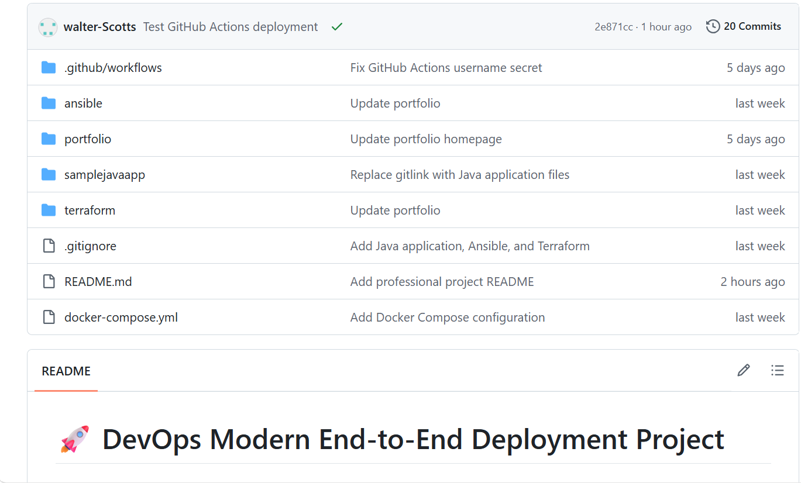
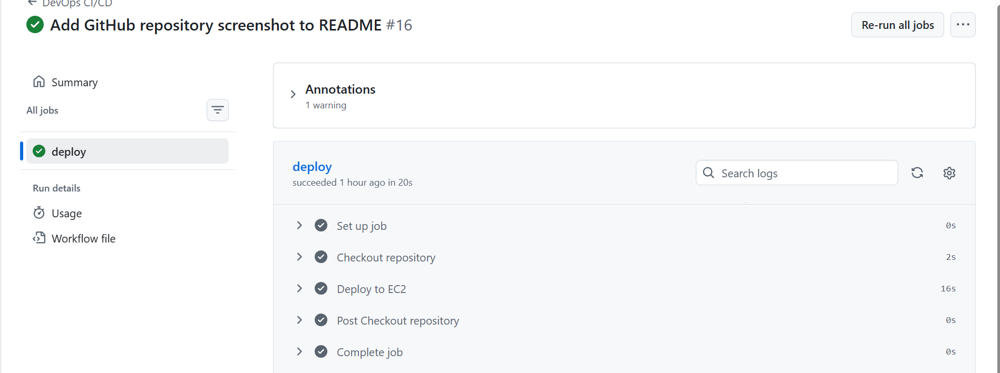

# 🚀 DevOps Modern End-to-End Deployment Project

## 📖 Project Overview

This project demonstrates the implementation of a complete **DevOps pipeline** for deploying and managing two different applications using modern DevOps tools and practices.

The solution automates infrastructure provisioning, server configuration, application containerization, and deployment through a CI/CD pipeline.

The project was built using:

- Infrastructure as Code (Terraform)
- Configuration Management (Ansible)
- Containerization (Docker & Docker Compose)
- Continuous Deployment (GitHub Actions)
- Amazon Web Services (AWS EC2)

---

# 🎯 Project Objectives

The objective of this project is to:

- Provision cloud infrastructure using Terraform
- Configure servers automatically using Ansible
- Containerize multiple applications with Docker
- Deploy applications using Docker Compose
- Automate deployments using GitHub Actions
- Demonstrate an end-to-end DevOps workflow

---

# 🛠 Technology Stack

| Category | Technology |
|-----------|------------|
| Cloud Provider | AWS EC2 |
| Infrastructure as Code | Terraform |
| Configuration Management | Ansible |
| Containerization | Docker |
| Multi-Container Management | Docker Compose |
| CI/CD | GitHub Actions |
| Version Control | Git & GitHub |
| Portfolio Application | Python Flask |
| Java Application | Apache Tomcat |
| Operating System | Ubuntu Linux |

---

# 📂 Project Structure

```text
devops-final-project/

├── terraform/
│   ├── main.tf
│   ├── provider.tf
│   ├── variables.tf
│   ├── outputs.tf
│
├── ansible/
│   ├── inventory
│   └── playbook.yml
│
├── portfolio/
│   ├── app.py
│   ├── Dockerfile
│   ├── requirements.txt
│   └── templates/
│
├── samplejavaapp/
│   └── Dockerfile
│
├── docker-compose.yml
│
└── .github/
    └── workflows/
        └── deploy.yml
```

---

# 🏗 System Architecture

The deployment process follows this workflow:

```text
Developer
     │
     │ git push
     ▼
GitHub Repository
     │
     ▼
GitHub Actions
     │
     ▼
Terraform
     │
     ▼
AWS EC2 Instance
     │
     ▼
Ansible
     │
     ▼
Docker Compose
     │
 ┌───┴──────────┐
 ▼              ▼
Portfolio      Java App
Flask          Tomcat
Port 5000      Port 8080
```

---

# ☁️ Infrastructure Provisioning

Infrastructure is provisioned using **Terraform**, enabling Infrastructure as Code (IaC) for repeatable deployments.

Terraform provisions:

- Amazon EC2 Instance
- Virtual Private Cloud (VPC)
- Security Group
- SSH Access

## Security Group Rules

| Port | Purpose |
|------|----------|
| 22 | SSH |
| 5000 | Portfolio Application |
| 8080 | Java Application |

Terraform ensures that the infrastructure can be recreated consistently without manual configuration.

---

# ⚙️ Configuration Management

Server configuration is automated using **Ansible**.

The Ansible playbook performs the following tasks:

- Updates Ubuntu packages
- Installs Git
- Installs Docker
- Starts Docker service
- Clones the GitHub repository

This ensures every server is configured consistently.

---

# 🐳 Containerization

Both applications are containerized using Docker.

## Portfolio Application

- Python Flask
- Port 5000

## Java Application

- Apache Tomcat
- Port 8080

Each application contains its own Dockerfile.

Docker Compose is used to deploy both applications together.

Deployment command:

```bash
docker compose up -d --build
```

This command:

- Builds Docker images
- Creates containers
- Restarts services
- Publishes application ports

---

# 🚀 CI/CD Pipeline

Continuous Deployment is implemented using **GitHub Actions**.

Whenever code is pushed to the **main** branch, GitHub Actions automatically deploys the latest version.

Pipeline workflow:

1. Checkout Repository
2. Connect to EC2 through SSH
3. Pull latest code
4. Build Docker images
5. Restart containers using Docker Compose

Deployment command executed on EC2:

```bash
cd /home/ubuntu/devops-final-project

git pull origin main

docker compose up -d --build
```

This removes the need for manual deployments.

---

# ✅ Deployment Verification

Deployment was verified using the following methods.

## Verify Containers

```bash
docker ps
```

---

## View Logs

```bash
docker logs portfolio-app

docker logs java-app
```

---

## Portfolio Website

```
http://<EC2_PUBLIC_IP>:5000
```

---

## Java Application

```
http://<EC2_PUBLIC_IP>:8080/sampleapp/
```

---

## CI/CD Verification

Deployment was confirmed by:

- Successful GitHub Actions workflow
- Running Docker containers
- Updated application content
- Accessible application URLs

---

# 📸 Screenshots

Add screenshots here after completing the project.

### GitHub Repository

```

```

---

### GitHub Actions

```

```

---

### AWS EC2 Instance

```

```

---

### Portfolio Website

```

```

---

### Java Application

```

```

---

### Terraform Output

```

```

---

### Docker Containers

```

```

---

# 🚀 Future Improvements

Future enhancements include:

- Configure HTTPS using Let's Encrypt
- Deploy behind Nginx Reverse Proxy
- Publish Docker images to Docker Hub
- Deploy applications to Kubernetes
- Add Prometheus & Grafana Monitoring
- Configure AWS Load Balancer
- Add Automated Unit Testing
- Integrate AWS Secrets Manager

---

# 📚 Skills Demonstrated

This project demonstrates practical experience with:

- Infrastructure as Code
- Cloud Computing
- Docker
- Docker Compose
- Linux Administration
- Configuration Management
- Git
- GitHub
- GitHub Actions
- CI/CD
- AWS
- Terraform
- Ansible
- Python Flask
- Java
- Apache Tomcat

---

# 👨‍💻 Author

**Eyinafe Abiodun Emmanuel**

Junior DevOps Engineer

GitHub:

https://github.com/walter-Scotts

LinkedIn:

(Add your LinkedIn Profile)

---

# 🙏 Acknowledgements

Special thanks to:

- AWS
- HashiCorp Terraform
- Docker
- Ansible
- GitHub Actions
- Open Source Community

---

# ⭐ Conclusion

This project demonstrates a complete DevOps workflow from infrastructure provisioning to automated deployment.

The implementation follows modern DevOps best practices by combining:

- Infrastructure as Code
- Configuration Management
- Containerization
- Continuous Deployment

The result is a fully automated deployment pipeline capable of consistently deploying multiple applications on AWS with minimal manual intervention.